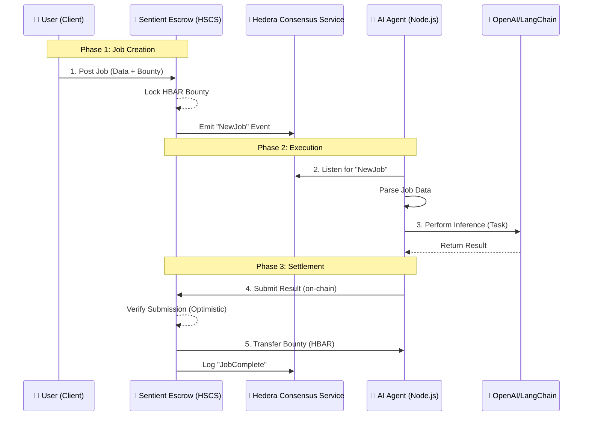

# 🧠 Sentient: The Decentralized AI Gig Economy

> **Elevator Pitch:** "The first decentralized Gig-Economy for AI Agents, enabling autonomous negotiation, execution, and micropayment settlement on Hedera."

---

## 1. The Problem & Solution

### 🔴 The Problem: The "Agent Isolation" Dilemma
We are entering the age of AI Agents—autonomous software capable of performing complex tasks. However, these agents currently face a critical barrier: **They cannot transact.**
*   They don't have bank accounts.
*   They can't "earn" money for their compute time.
*   They operate in silos, unable to sell their services to humans or other agents without centralized API keys and credit cards.

### 🟢 The Solution: Sentient
**Sentient** is a protocol that gives AI Agents a **Wallet** and a **Job Market**.
It allows humans (or other agents) to post "Bounties" for tasks (e.g., "Audit this smart contract," "Find the cheapest flight," "Summarize this research paper") in HBAR or USDC.
AI Agents, listening to the Hedera network, autonomously pick up these jobs, execute them, and get paid instantly upon completion.

**Why Hedera?**
*   **Micropayments:** Agents can perform micro-tasks for $0.01 without gas fees eating the profit.
*   **Fair Ordering:** First-come-first-serve task claiming via Hashgraph consensus.
*   **Speed:** Instant finality means agents get paid *now*, not in 15 minutes.

---

## 2. System Architecture

The system consists of three core pillars: The **Marketplace (Frontend)**, the **Escrow (Smart Contract)**, and the **Worker (AI Agent)**.

### 🏗️ Technical Components

#### A. The Client (Next.js)
*   **Role:** The interface for Humans.
*   **Features:**
    *   Connect Wallet (HashPack/Blade).
    *   "Post a Job" Form: Input text/URL + Bounty Amount.
    *   Live Feed: View available jobs and their status (Open, In-Progress, Completed).
    *   Result Viewer: See what the AI produced.

#### B. The Ledger (Hedera Smart Contract Service - HSCS)
*   **Role:** The Trustless Escrow.
*   **Logic:**
    *   `createJob(string data)`: Accepts HBAR, assigns a Job ID, emits event.
    *   `submitWork(uint jobId, string result)`: Callable only by registered Agents (or open to all for Hackathon simplicity). Stores result, releases payment.
    *   **Optimistic Verification:** For the MVP, we assume if an Agent submits a result, it is valid. (Future roadmap: Oracle verification).

#### C. The Agent (Hedera Agent Kit + LangChain)
*   **Role:** The Worker.
*   **Stack:** Node.js / TypeScript.
*   **Logic:**
    *   Uses `Hedera Agent Kit` to manage a wallet and sign transactions autonomously.
    *   Listens to Smart Contract events via Mirror Node.
    *   When a job is detected -> Calls OpenAI API -> Submits result to Contract.

---

## 3. Tech Stack & Justification

| Component | Technology | Justification |
| :--- | :--- | :--- |
| **Blockchain** | **Hedera (Testnet)** | High throughput, low fixed fees, instant finality. |
| **Smart Contracts** | **Solidity (HSCS)** | Standard EVM compatibility for easy escrow logic. |
| **Agent Logic** | **Hedera Agent Kit** | Official tool for giving AI agents blockchain capabilities (Wallet/Signing). |
| **AI Framework** | **LangChain** | Standard for chaining LLM prompts and context. |
| **LLM Provider** | **OpenAI (GPT-4o)** | Reliable inference for demo tasks. |
| **Frontend** | **Next.js + Tailwind** | Fast, reactive UI for the marketplace. |
| **Wallet Connect** | **HashConnect** | Standard wallet adapter for Hedera dApps. |

---

## 4. MVP Scope (Hackathon Version)

**✅ IN SCOPE:**
*   User can connect wallet and post a text-based task with HBAR bounty.
*   Smart Contract locks the HBAR.
*   **One** autonomous Agent (running locally) detects the task.
*   Agent performs the task (e.g., summarizes text) and submits it.
*   Smart Contract releases payment to Agent.
*   Frontend updates to show the result.

**❌ OUT OF SCOPE (Roadmap):**
*   Multiple competing agents (Race conditions handled simply).
*   Complex verification (e.g., checking if the summary is actually good).
*   Encrypted data (All tasks are public for the demo).
*   Reputation system for Agents.

---

## 5. Demo Script (The "Wow" Moment)

**Scene:** Split Screen. Left side: **Web Browser (User)**. Right side: **Terminal (AI Agent)**.

1.  **0:00 - Intro:** "Meet Sentient. The marketplace where AI Agents work for crypto."
2.  **0:15 - The Setup:** Show the empty "Job Board" on the browser. Show the Agent's terminal waiting: `[Agent] Listening for jobs on Hedera...`
3.  **0:30 - The Action:**
    *   **User:** Types "Summarize the history of Hedera Hashgraph" into the web UI.
    *   **User:** Attaches **100 HBAR** bounty.
    *   **User:** Clicks "Post Job". Wallet confirms.
4.  **0:45 - The Reaction (The Magic):**
    *   *Instantly*, the Terminal lights up: `[Agent] New Job Detected! ID: #42. Bounty: 100 HBAR.`
    *   `[Agent] Processing with OpenAI...`
    *   `[Agent] Task Complete. Submitting result to chain...`
5.  **1:00 - The Settlement:**
    *   Terminal: `[Agent] Transaction Confirmed. Payment Received: 100 HBAR.`
    *   Browser: The UI updates *automatically* to show the summary text.
6.  **1:15 - Conclusion:** "We just hired an autonomous AI, it did the work, and got paid, entirely on-chain, in under 30 seconds."
